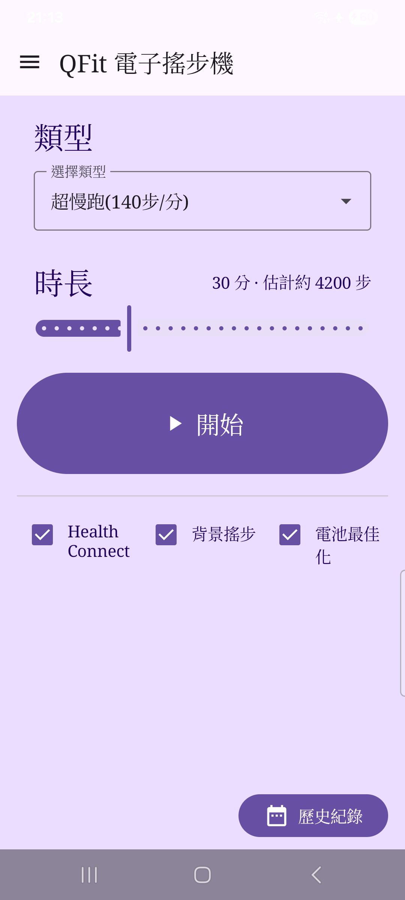

# Prompt for local agent: capture QFit guide screenshots (adb + scrcpy)

Copy everything below the line into your local agent.

---

## Mission

Capture screenshots for the QFit first-run user guide and wire them into `docs/index.html`.

Repo: local clone of `https://github.com/Pixson-Lin/QFit` (work on `main` or a short-lived branch).  
Guide page: `docs/index.html`  
Image folder: `docs/images/`  
Filename list is fixed — do not rename.

Tools: `adb` + `scrcpy` (or `adb exec-out screencap` if scrcpy capture is awkward). Phone must be USB-debugging connected (`adb devices` shows `device`).

## Deliverables

1. These PNG files under `docs/images/`:

| File | What must be visible |
|---|---|
| `01-home.png` | QFit Home: 類型 / 時長 / 開始 / 三個勾選列（Health Connect · 背景搖步 · 電池最佳化）· 右下歷史紀錄 |
| `02-health-connect.png` | System Health Connect permission / allow-access UI for QFit (steps / distance / exercise). If already granted, temporarily revoke in HC settings then reopen QFit to trigger, **or** open HC app permissions UI for QFit and shoot that |
| `03-background-run.png` | Home with **背景搖步** checked. Optional: include notification-permission dialog if it appears on Android 13+ |
| `04a-battery-dialog.png` | In-app dialog after tapping **電池最佳化** (title「設定電池用量」, buttons「前往設定」/「取消」) |
| `04b-app-info.png` | Android **應用程式資訊** for QFit, with **電池** row visible (do not need to open Battery yet) |
| `04c-unrestricted.png` | Per-app Battery page with three options; **不受限制** selected (or clearly highlighted). Samsung: 不受限制 / 最佳化 / 受限 |
| `05-type-duration.png` | Home focusing on **類型** dropdown open **or** closed with 超慢跑 visible, plus **時長** slider and estimate text on the title row |
| `06-in-progress.png` | **進行中** screen during an active run (步數 / 已進行總共 / 取消 visible) |
| `07-history.png` | **歷史紀錄** list with at least one finished card (紫框); optional: one card with 詳細記錄 expanded |

2. Update `docs/index.html`: for each figure that now has a real PNG, replace the `.shot-placeholder` `<div>` with:

```html

```

Keep `<figcaption>` unchanged. Do not leave broken `src`.

3. Commit with message like: `Add guide screenshots for first-run manual.`  
   Do **not** force-push. Open PR only if the user asked.

## Capture method (prefer)

```bash
# 0) prerequisites
adb devices
# one device only; if multiple, set ANDROID_SERIAL=

# Optional mirror (helpful for you to navigate):
scrcpy --no-audio

# 1) Preferred screenshot (no scrcpy UI chrome):
adb exec-out screencap -p > docs/images/01-home.png

# 2) If using scrcpy hotkey: focus scrcpy window, press s (default save).
#    Then move/rename the saved file into docs/images/ with the exact name above.
```

Rules for every shot:

- Portrait phone UI only.
- No status-bar secrets (hide notifications with personal content if possible).
- Prefer light/system default theme matching a normal first-run.
- Crop to the phone screen only (no desktop wallpaper around scrcpy window). If the PNG includes window chrome, re-capture with `adb exec-out screencap -p`.
- PNG, not JPEG. Reasonable size (if > ~4MB, compress lightly without blurry text).

## Exact navigation script (first-run order)

Install current debug APK first if needed:

```bash
adb install -r dist/qfit-mvp-debug.apk
# or build: ./gradlew :app:assembleDebug && adb install -r app/build/outputs/apk/debug/*.apk
adb shell am start -n com.pixsonlin.qfit/.MainActivity
```

### Shot 01 — Home

1. Land on Home with no dialogs open.
2. Ideal state: Health Connect checked if possible; 背景搖步 checked; 電池 may be unchecked (ok).
3. Capture → `01-home.png`.

### Shot 02 — Health Connect

1. If permissions already granted: Settings → Apps → Health Connect → App permissions → QFit → turn off write, return to QFit, tap **Health Connect** to re-prompt; **or** uninstall/clear QFit data then relaunch for first-run prompt.
2. Capture the system permission UI → `02-health-connect.png`.
3. Allow permissions afterward so later shots work.

### Shot 03 — 背景搖步

1. Home; ensure **背景搖步** is checked.
2. If notification permission dialog appears when toggling on, capture that as this shot (or a Home shot with the checkbox clearly checked).
3. Capture → `03-background-run.png`.

### Shot 04a — Battery guide dialog

1. On Home, tap **電池最佳化**.
2. Dialog visible (do **not** tap 前往設定 yet).
3. Capture → `04a-battery-dialog.png`.

### Shot 04b — App info

1. In the dialog, tap **前往設定**.
2. On QFit 應用程式資訊, scroll so **電池** is visible.
3. Capture → `04b-app-info.png`.

### Shot 04c — Unrestricted

1. Tap **電池**.
2. Select **不受限制**.
3. Capture the three-option page → `04c-unrestricted.png`.
4. Back to QFit; battery checkbox should become checked on resume.

### Shot 05 — Type / duration

1. Home.
2. Set 類型 to **超慢跑** (default). Optionally open the dropdown for a clearer shot.
3. Move 時長 to something readable (e.g. 5 or 20 minutes) so estimate text shows.
4. Capture → `05-type-duration.png`.

### Shot 06 — In progress

1. Ensure HC + 背景搖步 ready; start a **short** run (1–3 minutes).
2. On 進行中, wait until steps > 0 if possible.
3. Capture → `06-in-progress.png`.
4. Let it finish (or cancel after the shot). Prefer finishing once for History.

### Shot 07 — History

1. Home → **歷史紀錄**.
2. At least one card (已完成 preferred).
3. Optional: expand **詳細記錄** on one card.
4. Capture → `07-history.png`.

## HTML wiring checklist

For each completed image in `docs/index.html`, find the matching figure and change from:

```html
<div class="shot-placeholder">…</div>
```

to:

```html

```

Suggested `alt` text:

- 01: `QFit 主畫面`
- 02: `Health Connect 授權畫面`
- 03: `背景搖步已勾選`
- 04a: `電池設定說明對話框`
- 04b: `QFit 應用程式資訊頁`
- 04c: `電池用量選擇不受限制`
- 05: `類型與時長設定`
- 06: `搖步進行中畫面`
- 07: `歷史紀錄列表`

## Done criteria

- [ ] All 9 PNGs exist under `docs/images/` with exact names
- [ ] `docs/index.html` uses `` for each (no remaining placeholders for those shots)
- [ ] Open `docs/index.html` in a browser and confirm images load
- [ ] Commit (and push if appropriate)

## Out of scope

- Do not redesign the guide CSS/layout except image swaps.
- Do not change app code unless capture is blocked by a bug; if blocked, stop and report.
- Do not commit keystores, personal notification contents, or unrelated files.

## If stuck

- Multiple devices: `adb devices -l` then `export ANDROID_SERIAL=…`
- Black screencap: unlock phone, turn screen on (`adb shell input keyevent KEYCODE_WAKEUP`)
- OEM battery page differs: still capture the closest「不受限制 / Unrestricted」UI and note OEM in the commit message
